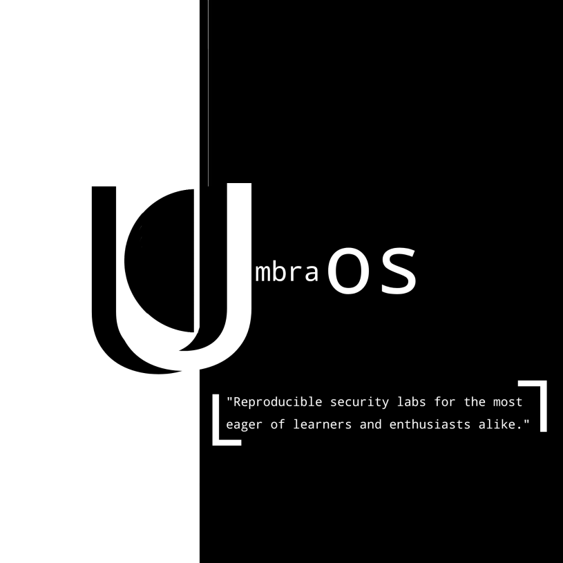

  

> Nix-based OS built for cybersecurity learners and enthusiasts alike.

UmbraOS is a Nix-based operating system built to make cybersecurity education reproducible, approachable, and hands-on.

Rather than shipping hundreds of tools and expecting users to figure everything out themselves, UmbraOS focuses on guided learning through reproducible lab environments and optional AI-assisted instruction.

## Goals

- Reproducible cybersecurity labs using Nix
- Safe experimentation through sandboxing
- Optional AI assistance (Local GGUF / Ollama / GroqCloud / None)
- Beginner-friendly without sacrificing flexibility
- Privacy-first (no mandatory telemetry)

## Planned Features

- [ ] Bootable ISO
- [ ] Nix flake installer
- [ ] Guided cybersecurity labs
- [ ] AI teaching assistant
- [ ] Lab authoring toolkit
- [ ] Community-contributed labs

## Status

🚧 Early development

## Join the Family
> https://discord.gg/f8Zxtmp9E
